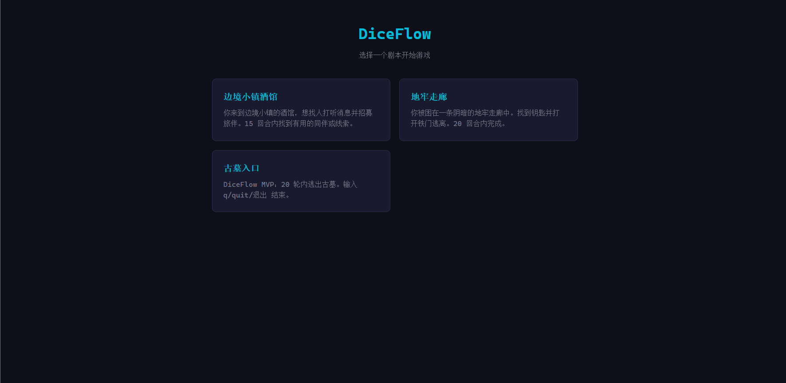
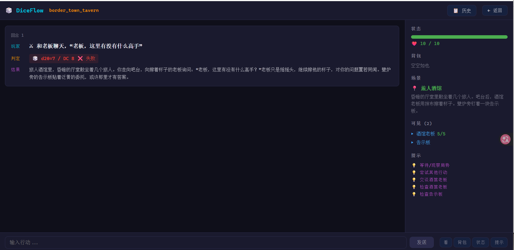

# DiceFlow

DiceFlow 是一个桌面角色扮演游戏（TRPG）引擎 MVP，结合确定性规则裁决与 LLM 驱动的意图解析和叙事生成。玩家输入中文行动描述，系统将其解析为标准动作，通过 D20 规则进行判定，更新游戏状态，并生成叙事反馈。

## 特性

- **脚本驱动**：游戏内容通过 YAML 脚本定义，包含实体、动作和结果表
- **原型系统**：实体从原型（npc、item、container、door、pickup）继承行为和属性
- **D20 规则引擎**：基于 D20 的判定，支持 DC 修饰符和结果表
- **动态裁决**：LLM + 启发式回退，处理未脚本化的行动（欺骗、潜行、发现等）
- **动态世界**：LLM 驱动的场景过渡与运行时内容生成
- **Web 前端**：React 浏览器界面，无需终端 UTF-8 支持
- **会话持久化**：游戏历史自动保存至磁盘

## 快速开始

### 环境配置

```bash
pip install -r requirements.txt
```

需要 DeepSeek API 密钥（可选，`--no-llm` 模式下使用启发式解析）：

```env
# .env
DEEPSEEK_API_KEY=your_key
DEEPSEEK_API_URL=https://api.deepseek.com/v1
```

### CLI 模式

```bash
# 默认剧本（边境小镇远征），启用 LLM
python main.py

# 指定剧本
python main.py --script dungeon_corridor

# 禁用 LLM（使用启发式解析和回退叙事）
python main.py --no-llm

# 禁用调试输出
python main.py --no-debug
```

### Web 模式

```bash
# Windows PowerShell 一键启动前后端
powershell -ExecutionPolicy Bypass -File .\scripts\start-web.ps1
```

浏览器访问 `http://localhost:5173`，选择剧本即可开始。

停止服务：

```bash
powershell -ExecutionPolicy Bypass -File .\scripts\stop-web.ps1
```

## 游戏指令

### 回合动作（消耗回合）
直接输入你想做的事，用中文描述行动：
- `攻击守卫`、`检查左门`、`打开左门`、`对话酒馆老板`

### 查看指令（不消耗回合）
- `look` / `看` / `观察` — 重新查看周围环境
- `inv` / `背包` — 查看背包中的物品
- `status` / `状态` — 查看当前血量与状态
- `hint` / `提示` — 查看可尝试的行动

### 系统指令
- `help` / `帮助` — 显示指令帮助
- `q` / `quit` / `退出` — 结束游戏

## 项目结构

```
diceflow/
  app/              # 应用层（Game 类、CLI、UI 渲染、提示生成）
  config.py         # 环境变量与 API 配置
  core/             # 核心游戏逻辑
  scripting/        # 脚本加载、原型系统、规则解析、验证
  llm/              # LLM 客户端、启发式解析与回退
  web/              # Web 服务端（FastAPI + 会话持久化）
  content/          # 游戏内容（YAML 剧本、提示词模板、Schema）
web/                # Web 前端（Vite + React）
  src/
    pages/          # 页面组件（剧本选择、游戏主界面）
    components/     # UI 组件（回合卡片、状态栏、输入栏等）
tests/              # 测试
data/sessions/      # 会话持久化目录
```

## 运行测试

```bash
PYTHONPATH=. pytest
PYTHONPATH=. pytest tests/test_web_api.py -v
```

## 技术栈

- **后端**：Python 3.12+、FastAPI、Uvicorn
- **前端**：React 18、Vite
- **LLM**：DeepSeek API（兼容 OpenAI SDK）
- **数据**：YAML 剧本、JSON 会话持久化
- **测试**：pytest + FastAPI TestClient


## 示例

剧本选择


游玩时

